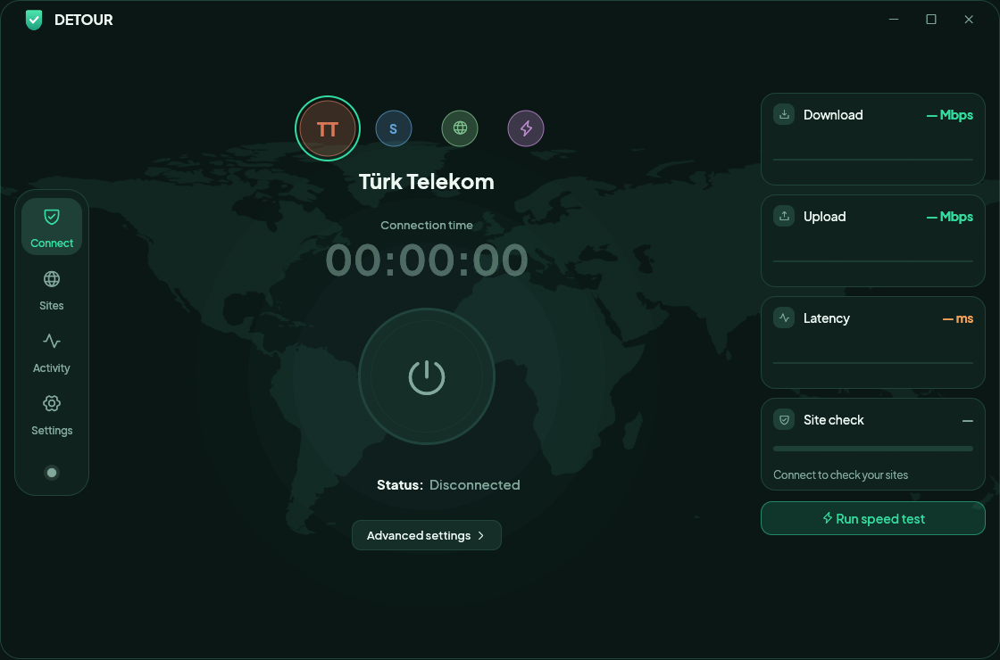

<div align="center">

# Detour

**One click, and the sites your ISP blocks are back.**

A small DPI-bypass app for Windows and macOS. No VPN, no servers, no accounts: your
traffic still goes straight to the site. Detour only changes how the first packets of
each connection look, so filters that read the site name miss it.



[**Download**](https://github.com/FurkanCodes/detour/releases/latest) ·
[How it works](#how-it-works) · [FAQ](#faq) · [Build from source](#build-from-source)

</div>

## Features

- **One-click connect.** A power button, a session timer and the status at a glance.
  Turning it off cuts everything it was carrying at once, so what you see is what is on.
- **All websites, or only the ones you pick.** Discord and Roblox lists are built in; add
  your own domains on the Sites tab.
- **Provider profiles** for networks that filter by hostname (Türk Telekom, Superonline,
  a generic one and an aggressive one), plus *Turbo*, *Balanced* and *Strong* modes for
  when the default is not enough.
- **DNS that is not poisoned.** The provider's clean resolver, Cloudflare, Google or Quad9,
  optionally over HTTPS.
- **Optional WARP tunnel (Windows)** for when the default method is not enough: Discord and
  Roblox, voice included, go through a free Cloudflare WARP tunnel, the way
  [SplitWire-Turkey](https://github.com/cagritaskn/SplitWire-Turkey) does it. See
  [WARP method](#warp-method-windows).
- **Live checks:** latency, a site check that loads your sites once after connecting, and
  a speed test you start yourself.
- Tray icon (menu bar icon on macOS), start at login, connect on launch. No telemetry and no account.

## Download

Get the latest build from the [Releases page](https://github.com/FurkanCodes/detour/releases/latest).

| | |
|---|---|
| **Windows 10 / 11** (64-bit) | Download `Detour-Windows.zip`, unzip it, run `Detour.exe` and accept the administrator prompt. |
| **macOS 11+** (Apple Silicon and Intel) | Download `Detour-macOS.zip`, unzip it, move `Detour.app` to Applications, then follow [First launch on macOS](#first-launch-on-macos). |

Both builds are **not code-signed** yet, so Windows SmartScreen ("More info", then "Run
anyway") and macOS Gatekeeper warn on first launch. Each release lists a SHA-256 checksum
(`SHA256SUMS.txt`) so you can verify the download.

Click **Connect**. Pick your provider on the Connect page if it is not the default.

### First launch on macOS

Because Detour is not signed or notarized by Apple, macOS may refuse to open it with a
message like *"Apple could not verify "Detour" is free of malware"* or *"Detour is damaged
and can't be opened"*. Nothing is wrong with the file: macOS marks everything downloaded
from the internet and blocks apps it cannot verify.

Remove that mark once, in Terminal (adjust the path if you put the app somewhere else):

```sh
xattr -dr com.apple.quarantine /Applications/Detour.app
```

Then open Detour normally. You can also try right-clicking the app and choosing **Open**,
or allowing it under System Settings → Privacy & Security → **Open Anyway**, but on recent
macOS versions the command above is the reliable way.

Only do this for builds you downloaded from this repository's
[Releases page](https://github.com/FurkanCodes/detour/releases); check the download against
`SHA256SUMS.txt` first:

```sh
shasum -a 256 Detour-macOS.zip
```

## How it works

Many ISPs block sites by reading the hostname (the SNI) in the first packet of an HTTPS
connection, and by answering DNS lookups for those names with a fake address. Detour does
two things about that:

1. **It looks names up through a resolver your ISP does not control**: Cloudflare over HTTPS
   by default, so the real address comes back.
2. **It sends the start of each connection in pieces**: the whole TLS handshake goes out one
   byte per packet, the way [BypaxDPI](https://github.com/BypaxDPI/BypaxDPI-Windows) does it,
   so the hostname is never in one packet. The server reassembles it; a filter that matches
   on the name misses it. Only the packet boundaries change, never the bytes, so sites that
   refuse unusual handshakes (many Turkish banks and e-Devlet) still work.

Nothing is relayed: your traffic goes directly to the site.

### Windows

Detour works like BypaxDPI: a **local proxy**, set as the Windows system proxy (and the
WinHTTP proxy that system services and native programs read) while Detour is on. Browsers
and other proxy-aware apps use it. It resolves names itself, so a poisoned DNS answer a
browser cached earlier cannot break a site, and switching Detour off cuts every connection
that went through it. Connectivity checks, Windows Update and game launchers stay direct.

Your own proxy settings (both kinds) are saved first and restored when you disconnect. If Windows shuts
down or Detour is killed while connected, a one-time logon task puts them back, and Detour
also repairs them the next time it starts.

On first connect Detour also exempts your installed Microsoft Store apps from Windows'
loopback restriction, because otherwise they cannot reach a proxy on `127.0.0.1` while it
is set. This is a one-time change.

### WARP method (Windows)

Settings → *Connection method* → **WARP tunnel** is an alternative for when reshaping the
handshake is not enough, for example when a provider blocks by IP address or a voice
connection will not start. Discord and Roblox then go through a free
[Cloudflare WARP](https://one.one.one.one/) tunnel, voice included. *Tunnel browsers too*
adds the browsers. Everything else stays on the Detour method. In this mode a packet engine
([WinDivert](https://reactos.org/wdk/windivert/), signed driver embedded in the app) also
fixes DNS for the tunnelled programs.

This is a tunnel: tunnelled apps show a Cloudflare IP address. Detour does not run it
itself. The first connect:

1. downloads and silently installs [WireSock Secure Connect](https://www.wiresock.net/)
   3.6.1.1, which runs the tunnel for chosen programs only. It is free for personal and
   non-profit use ([licence](https://www.wiresock.net/license/wiresock_eula)) and installs
   its own driver and two services;
2. downloads [wgcf](https://github.com/ViRb3/wgcf) 2.3.0 and uses it to register a free
   WARP device.

Both downloads are checked against pinned SHA-256 checksums before they run. Later connects
take a few seconds. Disconnecting takes the tunnel down, and if Detour is killed while
connected, it takes the tunnel down the next time it starts. A fresh WireSock install
sometimes needs a Windows restart before its service starts; Detour says so when that
happens.

### macOS

macOS has no packet driver Detour can use, so the Mac build runs only the local proxy and,
while connected, points the system web proxy (`networksetup`) at it. It covers apps that
follow the system proxy settings, which includes the major browsers. macOS asks for an
administrator password when it needs one, and your previous proxy settings are restored on
disconnect. Detour also puts a shield icon in the menu bar (solid when connected, faded when
off); click it to turn Detour on or off, open the window or quit. With *Keep running in the
menu bar* on, closing the window leaves Detour running there. The encrypted DNS toggle and
the WARP method are Windows-only.

## FAQ

**Is it a VPN?** Not by default. Nothing is tunnelled to a server and your IP address does
not change. The optional [WARP method](#warp-method-windows) is a tunnel, but only for the
apps it lists.

**Will it work on my ISP?** The profiles were tuned on Türk Telekom. Other ISPs that block
by hostname usually respond to the *Generic* profile or the *Turbo / Balanced / Strong*
modes; the *Aggressive* profile throws everything at it. ISPs that block by IP address, or
by deep inspection of the whole handshake, are out of reach for this technique.

**Where do my DNS lookups go?** With the default *Provider* resolver on the Türk Telekom
and Superonline profiles, lookups for the sites you open go to Yandex DNS (`77.88.8.8`, port
1253), which is not affected by the ISP's poisoning. You can pick Cloudflare, Google or
Quad9 instead, and turn on encrypted DNS. If the chosen resolver has no answer for a name,
the proxy asks Cloudflare over HTTPS before giving up. The speed test talks to Cloudflare's
public speed servers, and only when you press the button.

**Why does Windows ask for administrator rights?** The packet driver needs them.

**Antivirus flags it.** Detour embeds the WinDivert driver, which tools that rewrite
network packets are commonly flagged for. The source is here to read and build yourself.

**macOS says Detour is damaged or can't be verified.** See
[First launch on macOS](#first-launch-on-macos).

**My browser says "proxy server is not responding".** Detour was closed abruptly while
connected. Start Detour again (it repairs your proxy settings on launch), or turn off
**Use a proxy server** under Settings → Network & Internet → Proxy.

**A site works with Detour off but not on.** Open the Activity tab, turn on *Detailed
activity* in Settings, and look at what Detour did for that site. Open an issue with the
log if you can.

## Controls

- **Connect** page: provider picker, power button, live measurements.
- **Sites** tab: *All websites*, the built-in lists, and your own domains.
- **Activity** tab: what the engine is doing right now.
- **Settings** tab: connection method (Windows), bypass mode, DNS resolver, connect on
  launch, keep running in the tray, start at login, encrypted DNS and HTTP/3 fallback
  (Windows), detailed activity.

## Local data

| | Windows | macOS |
|---|---|---|
| Settings | `%APPDATA%\Detour\settings.toml` | `~/Library/Application Support/Detour/settings.toml` |
| Driver files, proxy backup | `%LOCALAPPDATA%\Detour\driver` | `~/Library/Application Support/Detour` |
| WARP account and profile | `%LOCALAPPDATA%\Detour\warp` | |

Uninstalling is deleting the app and those folders. If you enabled *Start at login*,
turn it off first. If you used the WARP method, WireSock Secure Connect stays installed;
remove it under Settings → Apps like any other program.

## Build from source

You need [Rust](https://rustup.rs) (stable).

```sh
cargo test --workspace          # unit tests
cargo run --release -p detour-app
```

Package like the releases do:

```powershell
# Windows -> dist/Detour-Desktop/
pwsh scripts/package.ps1
```

```sh
# macOS -> dist/Detour.app (universal)
bash scripts/package-macos.sh
```

The workspace has these crates:

| Crate | What it is |
|---|---|
| `detour-app` | the desktop app (egui) |
| `detour-engine` | ClientHello rewriting, DNS handling, the WinDivert engine and the local proxy |
| `detour-core` | domain lists and presets |
| `detour-service`, `detour-cli` | an optional Windows-service front end for the engine |

Releases are built by GitHub Actions: pushing a tag like `v0.2.1` builds both platforms and
publishes the release.

## Credits and licence

- Detour is released under the [MIT licence](LICENSE).
- Packet capture: [WinDivert](https://reactos.org/wdk/windivert/) 2.2.2 by basil, used
  under the LGPL (`vendor/windivert/LICENSE`, shipped next to the app).
- Font: [Plus Jakarta Sans](https://github.com/tokotype/PlusJakartaSans) by Tokotype, SIL
  Open Font License (`assets/fonts/OFL.txt`).
- Map: [Natural Earth](https://www.naturalearthdata.com/) 1:110m land, public domain.
- The system-proxy approach follows [SpoofDPI](https://github.com/xvzc/SpoofDPI) and
  BypaxDPI.
- The WARP method follows [SplitWire-Turkey](https://github.com/cagritaskn/SplitWire-Turkey)
  and uses [WireSock Secure Connect](https://www.wiresock.net/) (freeware, downloaded on
  first use, not shipped with Detour) and [wgcf](https://github.com/ViRb3/wgcf) (MIT).

Use Detour only where doing so is lawful for you. It does not hide who you are from the
sites you visit.
